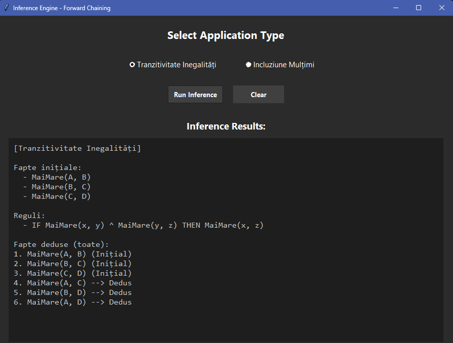
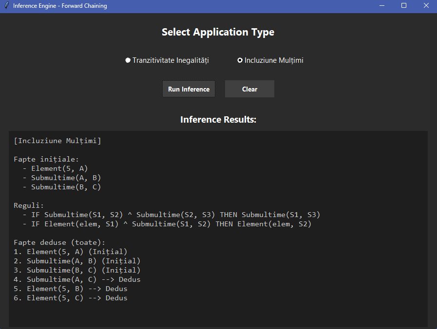

# Proiect Inteligență Artificială

## Inferență predicativă prin raționament înainte

**Profesor coordonator:** Prof. dr. ing. Mircea HULEA  
**Student:** Șerban-Ilie LOSTUN

---

## 1. Descrierea problemei considerate

### 1.1. Context general

Unul dintre domeniile fundamentale ale Inteligenței Artificiale este demonstrarea automată a teoremelor, având ca scop simularea raționamentului logic uman prin mijloace computaționale. Logica formală oferă un cadru riguros pentru codarea cunoștințelor și derivarea de noi adevăruri. Formalismul logic permite deducerea unor noi cunoștințe (concluzii) din cunoștințe deja existente (premise), printr-un proces numit inferență logică.

Proiectul de față implementează un sistem bazat pe reguli care utilizează **logica predicatelor de ordinul I** (First-Order Logic). Aceasta permite o reprezentare detaliată a realității prin variabile, cuantificatori și predicate, fiind esențială în matematică, unde teoremele sunt formulate ca relații general valabile între obiecte abstracte.

### 1.2 Obiectivul proiectului

Scopul principal este dezvoltarea unui algoritm capabil să realizeze raționamente de tip **Forward Chaining** (Raționament Înainte). Acest tip de raționament este ghidat de date: procesul pornește de la o mulțime de fapte inițiale cunoscute și aplică iterativ reguli de inferență pentru a genera noi fapte, până când se ajunge la demonstrarea unei concluzii (scopul) sau nu se mai pot deduce informații noi.

### 1.3 Aplicații matematice considerate

Pentru a valida funcționalitatea și corectitudinea motorului de inferență, au fost selectate două probleme demonstrative cu relevanță matematică, din domeniile Algebrei și Teoriei Mulțimilor. Aceste probleme implică proprietăți de tranzitivitate care necesită un mecanism de unificare a variabilelor.

#### 1. Demonstrarea tranzitivității inegalităților stricte

Prima problemă abordează o proprietate fundamentală a relațiilor de ordine în algebra elementară. Se consideră un set de inegalități definite între numere reale și se dorește demonstrarea faptului că relația "mai mare decât" este tranzitivă.

* **Premise:** Se oferă un lanț de inegalități de forma *a > b*, *b > c* și *c > d*.
* **Regulă:** Axioma de tranzitivitate: ∀*x*, *y*, *z*, (*x > y* ∧ *y > z*) → (*x > z*).
* **Scop:** Sistemul trebuie să deducă automat relația *a > d*, parcurgând pașii intermediari (*a > c*) prin aplicarea succesivă a regulii.

#### 2. Demonstrarea apartenenței la o mulțime prin incluziune

A doua problemă, din Teoria Mulțimilor, testează capacitatea sistemului de a combina predicate diferite ("este element al" și "este submulțime a").

* **Premise:** Se cunoaște faptul că un element x aparține unei mulțimi A (x ∈ A) și există o ierarhie de incluziune a mulțimilor: A ⊆ B și B ⊆ C.
* **Reguli:**
    1. Definiția submulțimii: ∀e, S1, S2, (e ∈ S1 ∧ S1 ⊆ S2) → e ∈ S2.
    2. Tranzitivitatea incluziunii: ∀S1, S2, S3, (S1 ⊆ S2 ∧ S2 ⊆ S3) → S1 ⊆ S3.
* **Scop:** Demonstrarea faptului că elementul x aparține mulțimii C (x ∈ C).

---

## 2. Aspecte teoretice privind algoritmul

### 2.1 Logica Predicatelor de Ordinul I

Pentru acest proiect, am ales **Logica Predicatelor de Ordinul I** (First-Order Logic) deoarece permite lucrul cu variabile. Într-o problemă matematică, nu avem doar propoziții fixe, ci relații generale între obiecte.

Elementele principale folosite sunt:
* **Variabile** și **Constante**: Reguli generale cu simboluri precum x sau y, înlocuite apoi cu valori concrete (ex: 5, Mulțimea A).
* **Predicate**: Funcții care descriu o relație. De exemplu, MaiMare(x, y) spune că x este mai mare ca y.
* **Cuantificatori**: Ideea de „Oricare ar fi x” (∀x) pentru reguli universale.

### 2.2 Algoritmul de Raționament Înainte (Forward Chaining)

Logica de inferență aplicată funcționează pe principiul **Forward Chaining**. Este o metodă data-driven: pornim de la ce știm deja (faptele) și încercăm să aflăm lucruri noi.

Pașii algoritmului:
1. **Căutare:** Algoritmul verifică toate regulile din baza de cunoștințe și dacă premisele lor se potrivesc cu faptele cunoscute.
2. **Aplicare:** Dacă o regulă se potrivește, se activează și generează o concluzie nouă.
3. **Actualizare:** Noul fapt descoperit este adăugat în memorie.
4. **Repetiție:** Procesul se reia până când găsim soluția finală sau nu mai avem reguli de aplicat.

### 2.3 Unificarea (Potrivirea variabilelor)

Regulile conțin variabile (ex: x), iar faptele conțin valori concrete (ex: 5). Programul are nevoie de un proces numit Unificare: "potrivirea" datelor, adică găsirea valorii care să înlocuiască variabila x astfel încât regula să aibă sens.

*Exemplu:* Dacă avem regula „Dacă x e om, x e muritor” și faptul „Socrate e om”, unificarea decide că x = Socrate.

### 2.4 Teoremele Matematice Utilizate

Pentru testare, am ales două probleme bazate pe **tranzitivitate**.

**A. Inegalități (Algebră):**

    ∀a, b, c, (a > b ∧ b > c) → a > c

**B. Incluziunea Mulțimilor:**

    ∀x, A, B, (x ∈ A ∧ A ⊆ B) → x ∈ B

---

## 3. Modalitatea de rezolvare

### 3.1 Arhitectura Aplicației

Aplicația a fost dezvoltată în **Python**, cu o structură modulară pentru a separa logica de inferență de datele particulare. Structura proiectului:

1. **structuri.py**: Tipuri abstracte de date pentru logică (Predicate și Reguli).
2. **date.py**: Bază de cunoștințe externă, cu axiomele și faptele inițiale pentru problemele considerate.
3. **inferenta.py**: Algoritmul *Forward Chaining* și mecanismul de unificare.

### 3.2 Implementarea Structurilor de Date

Două clase fundamentale în *structuri.py*:
- **Predicat**: Modelează un fapt atomic sau o componentă a unei reguli. Are nume (string) și listă de argumente (constante sau variabile). Metoda `__eq__` permite compararea semantică a predicatelor.
- **Regula**: Modelează implicațiile logice de tip Clauză Horn (P1 ∧ P2 ⋯ →C). Are o listă de premise și o concluzie.

### 3.3 Organizarea Bazei de Cunoștințe

Datele problemelor nu sunt hardcodate, ci extrase din funcții dedicate în *date.py*.
- **Problema Inegalităților**: Fapte de tip MaiMare(x, y) și o regulă de tranzitivitate.
- **Problema Mulțimilor**: Predicate de tip Element și Submultime, reguli pentru tranzitivitatea incluziunii și definiția apartenenței.

### 3.4 Algoritmul de inferență propus

Fluxul de execuție:
1. **Inițializare:** Se încarcă faptele inițiale și regulile din modulul de date.
2. **Ciclul de Inferență:**
   - Se parcurge lista de reguli.
   - Pentru fiecare regulă, se utilizează funcția de **Unificare** pentru a verifica dacă premisele se potrivesc cu faptele existente.
   - Unificarea generează un set de substituții (ex: {x: a, y: b}).
3. **Generarea Concluziei:** Substituțiile sunt aplicate asupra concluziei regulii.
4. **Actualizare:** Dacă noul fapt nu există în bază, este adăugat. Procesul se repetă până la saturație (nu se mai pot deduce fapte noi).

---

## 4. Părți semnificative din codul sursă

Sunt prezentate componentele esențiale: structurile de date pentru reprezentarea cunoștințelor, mecanismul de unificare a termenilor și bucla principală a motorului de inferență.

---

## 5. Rezultate obținute

### 5.1 Inegalități (Algebră)

În acest caz, am pornit de la faptele inițiale A > B, B > C și C > D, având la dispoziție regula de tranzitivitate.

Figura 5.1. Rezultatul inferenței pentru problema inegalităților.

**Analiza rezultatului:**

Sistemul a preluat faptele și a aplicat regula în mai mulți pași:
- A dedus faptele intermediare: MaiMare(A, C) și MaiMare(B, D).
- Folosind aceste noi informații, a ajuns la concluzia finală: MaiMare(A, D). Marcajul --> Dedus confirmă că aceste informații au fost generate logic de algoritm.

### 5.2 Teoria Mulțimilor

Am testat capacitatea sistemului de a combina reguli diferite. Am pornit de la faptul că elementul 5 este în mulțimea A, iar A este inclusă în B, care la rândul ei este inclusă în C.

Figura 5.2. Rezultatul inferenței pentru problema mulțimilor.

**Analiza rezultatului:**

Sistemul a funcționat corect, realizând două tipuri de deducții simultan:
- **Tranzitivitatea mulțimilor:** A dedus că dacă A inclus în B și B este inclus în C, atunci Submultime(A, C).
- **Propagarea elementului:** A dedus că elementul 5 se află și în mulțimea B, și în mulțimea C (Element(5, C)), aplicând regula de incluziune pas cu pas.

---

## 6. Concluzii

Proiectul a atins toate obiectivele propuse, rezultând o aplicație funcțională capabilă să realizeze raționamente automate folosind **Forward Chaining**.

Puncte cheie:
- **Versatilitate:** Același algoritm rezolvă probleme din domenii diferite fără a modifica codul sursă, ci doar fișierul de date.
- **Interfață Prietenoasă:** Interfața grafică (GUI) cu tema "Dark Mode" face aplicația ușor de utilizat.
- **Corectitudine:** Sistemul gestionează corect diferența dintre variabile și constante, evitând erori logice și oprindu-se automat când demonstrația este completă.

---

## 7. Bibliografie

1. **Russell, S., & Norvig, P.** (2020). *Artificial Intelligence: A Modern Approach* (4th ed.). Pearson. (Capitolele despre First-Order Logic).
    [https://aima.cs.berkeley.edu](https://aima.cs.berkeley.edu)
2. **Leon, F.** (2024). *Suport de curs: IA06_Logica - Metode de inferență în logica propozițională și predicativă*. Universitatea Tehnică „Gheorghe Asachi” din Iași.
    [https://florinleon.byethost24.com/curs_ia.html](https://florinleon.byethost24.com/curs_ia.html)
3. [https://en.wikipedia.org/wiki/Inequality_(mathematics)](https://en.wikipedia.org/wiki/Inequality_(mathematics))
4. [https://www.britannica.com/science/set-theory/Operations-on-sets](https://www.britannica.com/science/set-theory/Operations-on-sets)
5. **GeeksforGeeks**. "Forward Chaining and Backward Chaining in AI".
    [https://www.geeksforgeeks.org/artificial-intelligence/forward-chaining-and-backward-chaining-inference-in-rule-based-systems/#how-forward-chaining-works](https://www.geeksforgeeks.org/artificial-intelligence/forward-chaining-and-backward-chaining-inference-in-rule-based-systems/#how-forward-chaining-works)
6. **GeeksforGeeks**: “Forward Chaining in AI with FOL proof”
    [https://www.geeksforgeeks.org/artificial-intelligence/forward-chaining-in-ai-with-fol-proof/](https://www.geeksforgeeks.org/artificial-intelligence/forward-chaining-in-ai-with-fol-proof/)
